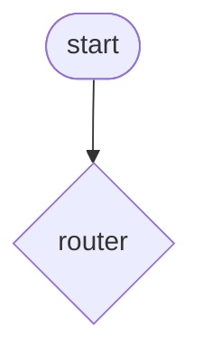

# Process model -- team ____________

This file is a deliverable of Iteration 1: fill in sections 0–8 *before* you implement (Tasks 3a, 4a, 5a) and complete the last of them after you have exported the diagram (Task 2). Iteration 2 adds nothing to it — that iteration is handed in as running code, tests and the numbers its scripts print.

Which section belongs to which task:

| section | filled during |
| --- | --- |
| 0. three answers about the demo graph | Task 1 |
| 1. the dialog as a sequence | Task 5a, from the run in Task 6 |
| 2. the components and their contracts | Tasks 3a, 4a, 5a |
| 3. the process, drawn by hand | Tasks 3a and 4a (one component each), 5a (the whole process) |
| 4. the exported process model | Task 2, with `--pizza` in Task 6 |
| 5. differences between 3 and 4 | Task 6 |
| 6. cases our rules cannot handle | Tasks 3c and 4c |
| 7. contract hand-over | Task 7 |
| 8. our baseline | Task 6, and again in Iteration 3 |

## 0. Three answers about the demo graph (Task 1)

1. A node returns `{"style": "formal"}`. What happens to the other fields of the state?

2. `choose_style` returns a string. Why is that *not* a state change, and why does it matter for the diagram?

3. Where would you look to find out why the bot chose the formal branch: in the code, or in the log? What does your answer imply for a system that runs in production?

## 1. The dialog, as a sequence

Who says what, in the shortest complete order. One line per turn. Mark for every bot turn which component produced it.

| # | speaker | utterance | component | state after the turn |
| --- | --- | --- | --- | --- |
| 1 | user | I would like a Margherita | | |
| 2 | bot | | | |
| 3 | user | | | |
| 4 | bot | | | |

## 2. The components and their contracts

One row per component. Copy the contract from the docstring in the code -- or, better, write it here first and copy it into the code afterwards.

One row per component, in the six parts from the reference section of the sheet. Copy the contracts of the three components you implement (`pizza_recognition`, `address_recognition`, `order_form` with `router` and `slots_complete`); for the given ones (`order_placement`, `confirmation`, `help`) one line each is enough.

| component | reads | writes | calls | rule(s) | guarantee | failure behaviour |
| --- | --- | --- | --- | --- | --- | --- |
| router | | | | | | |
| pizza_recognition | | | | | | |
| address_recognition | | | | | | |
| order_form | | | | | | |
| slots_complete | | | | | | |
| order_placement | | | | | | |
| confirmation | | | | | | |
| help | | | | | | |

## 3. The process, drawn by hand

Draw it on paper or in Mermaid -- both count, as long as every node, every edge and every decision is visible. Inputs and outputs belong on the arrows, not only in your head.



## 4. The exported process model (Task 2)

Run `python demo_visualize.py --pizza`, then paste the content of `docs/pizza-process-model.mmd` here and commit `docs/pizza-process-model.png` next to it.

```mermaid
%% TODO: paste the exported Mermaid source
```

## 5. Differences between 3 and 4

Every difference is a bug in exactly one of the two: either you drew something the code does not do, or the code does something nobody designed.

| # | what differs | which one is wrong | what we changed |
| --- | --- | --- | --- |
| 1 | | | |

## 6. Cases our rules cannot handle (keep this list)

The utterances where a static rule gives up. This list is not a failure report, it is the specification for Iteration 2 -- these are the cases an LLM will be asked to take over, and the measurement in Iteration 3 will use exactly them.

Three kinds, and the difference matters: *(a) the type lacks a field* (a postcode has nowhere to go), *(b) the pattern is too narrow* (a comma is missing), *(c) the rule applies and the answer is still wrong* (`42000` accepted as a house number). Iteration 3 measures the third kind.

| # | utterance | what should happen | what happens now | why the rule fails | kind (a/b/c) |
| --- | --- | --- | --- | --- | --- |
| 1 | | | | | |

## 7. Contract hand-over (Task 7)

We implemented the `address_recognition` contract of team ____________, and team ____________ implemented ours.

| # | row that came out differently | which part failed us? (reads / writes / rules / guarantee / failure) | was the contract silent, or did we read it differently? | the sentence that would have prevented it |
| --- | --- | --- | --- | --- |
| 1 | | | | |
| 2 | | | | |

The sentences from the last column, added to our own contract:

*

## 8. Our baseline (Task 6)

The number Iteration 3 will compare against. Count the rows in your own validation cases that the bot gets right today.

| date | cases | correct | notes |
| --- | --- | --- | --- |
| | | | |

