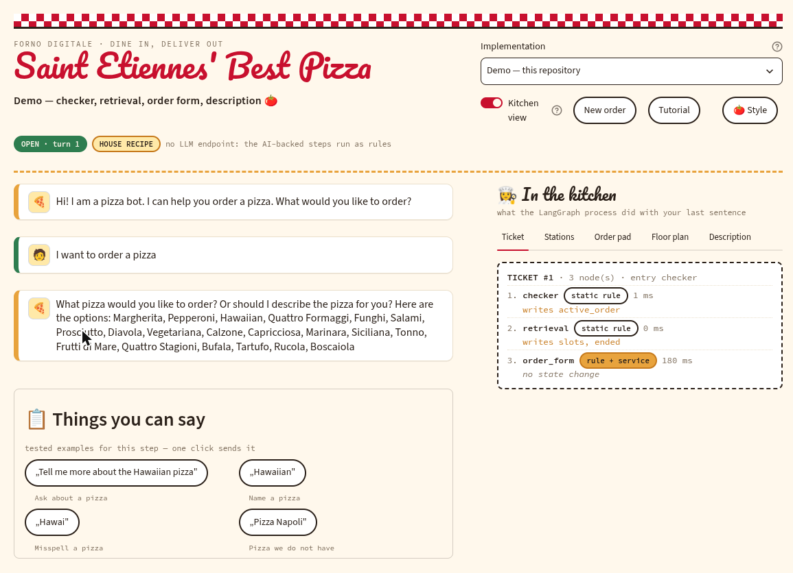

# Exercise 4 — dynamic data and flexible processes

Iteration 4 of *Engineering AI-Driven Software Processes — Hands-on KGQA with LangGraph and LLMs*, Université Jean Monnet Saint-Étienne, WS 2026/2027.

**Today your bot stops knowing things and starts looking them up.** Three iterations long it has filled a form: which pizza, which address, place the order. It knew exactly one thing about the world — the list of names `GET /pizza` returns — and everything else was in the code. That is fine for a demo and false for every real application, where the domain knowledge is large, **changes without asking you**, and the user cannot possibly know what is in it.

So: a **second process in the same system**, and the data it reads.

1. **Factoid question answering, decomposed.** *“What is on the Hawaiian?”, “Which pizzas are vegan?”, “Who invented it?”* — as four nodes with a contract each: entity linking → query construction → query execution → answer generation, compiled as a sub-graph and invoked as one step of the dialog process.
2. **Data that changes.** Nobody knows the whole menu. The guest explores it instead, the names are read from the graph on **every** turn, and a follow-up question keeps the constraints of the one before — *“…and which of those are without milk?”*
3. **A number for the new process.** A factoid benchmark whose cases are generated from the graph, four metrics, and a report whose last line says whether this configuration ships.

**The shape of the session:** you build the nodes first (Tasks 2–5), then you watch them work in the web UI with the kitchen view open (Task 6). Building before looking is deliberate — the kitchen view is much more interesting when you already have a prediction to check it against.

**You are not expected to arrive knowing SPARQL.** Every query you need is written, working and explained; Task 2 hands you the module and Appendix A explains every line of it.

**Ninety minutes.** One slot, six tasks, and every one of them has a command that says whether it is done. The sheet hands you more code than the last three did — the SPARQL module, both test files, the benchmark — because what is being taught today is the *decomposition*, not the typing: which of four nodes a fact passed through, and which of four numbers decides whether it ships.

*Three things that were in this session's draft and are now Iteration 5: **repair** (the guest names a pizza we cannot deliver today), **fuzzy input** (the guest describes instead of naming), and **the extension of your own**, which moved with them so that it can build on all three. Repair and fuzzy input follow from a menu that moves, which is why they used to be here; both need a lecture of their own, which is why they are not.*

## Definition of done

1. `python -m pizzabot.kb --selftest` — the graph loads, 617 triples, 19/19 checks green.
2. `pytest -q` — green, **including** your Iteration 3 tests, which must not have gone red on the way.
3. `pytest -q -m gate` — green: the four QA nodes exist and are compiled as a **sub-graph** invoked as one node; the six state fields exist; `question_understanding` is in both configuration dictionaries.
4. The diagram exported from `build_graph()` shows the QA step, and it is the **same** for the static and the LLM configuration.
5. `factoid-report.md` committed — generated by `factoid_benchmark.py`, never typed — with **four** metrics, the confidence intervals, and the gate line. `factoid-history.jsonl` has at least two runs: static and LLM, over the same cases.
6. The drift check between the graph and `GET /pizza` runs in your suite.
7. In the browser: the five sentences of Task 6 behave as predicted, and for each one you can point at the **Ticket** and **Order pad** tabs and say which node produced which field.
8. You can say, out loud and in one minute: **which of the four numbers decided which configuration ships**, and what would have to change in your code if the menu grew to 200 pizzas tomorrow.

| | task | minutes | you are done when |
| --- | --- | --- | --- |
| ☐ | 1 — your bot in the Streamlit UI | 0–10 | your bot is in the picker and the **Floor plan** is your own process model |
| ☐ | 2 — the knowledge base behind the counter | 10–15 | `python -m pizzabot.kb --selftest` → 19/19 green |
| ☐ | 3 — the QA sub-graph: four nodes | 15–50 | `pytest -q tests/test_task3_qa.py` green, gate green; the Floor plan shows one `question_answering` step |
| ☐ | 4 — data that changes: the guest explores | 50–70 | `pytest -q tests/test_task4_dynamic.py` green; a follow-up answers **2 and not 3** |
| ☐ | 5 — measure it: the factoid benchmark | 70–82 | `factoid-report.md` generated for **both** configurations, gate line read out |
| ☐ | 6 — test it in the UI, kitchen view open | 82–90 | five sentences, five predictions, five tickets that match |

Tasks 3 and 4 each end with their own test file, given and parameterized over cases **computed from the knowledge base**. Two commands per task: `pytest -q tests/test_taskN_*.py` says whether the *bot* works, `pytest -q -m gate` says whether *you* did the task — the same split as Iteration 3. Task 5 turns the same idea into a number.

**Do the Preparation before the slot starts** — the clone, the virtual environment and the copies are ten minutes that nobody should spend in the room. If you are short of time inside the session, Task 5 is the one to shorten (run one configuration instead of two) and Task 3 is the one that may never be skipped: Tasks 4, 5 and 6 all stand on it.

---

## Preparation [~10 min]

**1. Get the material.**

| your Iteration 3 repository | do this |
| --- | --- |
| **complete** — `pytest -q` green, `quality-report.md` committed | clone this material *outside* your repository, then copy `data/` into it. Keep your own `pizzabot/` — it is the one that grows today. |
| **not complete** | start from the Iteration 3 material in the `exercise-03/` folder beside this one, copy `data/` from here into it, and carry on. An unfinished Iteration 3 does not cost you Iteration 4. |

```bash
python3 -m venv .venv && source .venv/bin/activate     # Windows: .venv\Scripts\activate
pip install -r requirements.txt                        # rdflib is already in it since Iteration 3
```

**2. What you are given.** Three Turtle files, one page of documentation, and the module that queries them. You do not edit the Turtle and you do not write SPARQL; you read both and you call functions.

| file | what it is |
| --- | --- |
| `kb.py` | **the only module with SPARQL in it** — copy it to `pizzabot/kb.py`. Nine queries, a function per question, and a `--selftest` that proves all nine still answer what they should |
| `tests/` | **the test files of Tasks 3 and 4**, plus `conftest.py` and `bot_helpers.py` — copy all four into your `tests/`. Nothing to merge: pytest reads your Iteration 3 `conftest.py` at the repository root and this one under `tests/`, and uses the fixtures of both |
| `factoid_benchmark.py` | **Task 5**: 79 cases generated from the graph, four metrics, `factoid-report.md` and `factoid-history.jsonl`. Copy it to your repository root, beside `evaluate.py` |
| `data/menu-facts.ttl` | **our own knowledge**: 22 pizzas, each with its toppings, its `pz:apiId`, a description and six dietary flags; 34 toppings |
| `data/wikidata.ttl` | what was **retrieved from Wikidata** through the curated links: inventor, year, country of origin, ingredients as *somebody else* lists them |
| `data/wikidata-links.ttl` | the links themselves, in SKOS — `exactMatch`, `closeMatch`, `relatedMatch`, or explicitly *not found* |
| `data/pizza-data.md` | **read this when a query surprises you**: every property with its meaning, every pizza with every fact it carries, every topping |

**3. A number to keep in mind.** The graph knows **22** pizzas. `GET /pizza` sells **20**. That is not a bug in the data — it is what every real system looks like: the knowledge base and the thing that takes orders are two systems, and they are never exactly in step. Task 4d makes it a **test**; Iteration 5 makes it a **dialog**.

---

## Glossary

Seven words this sheet uses constantly, on top of the Iteration 1–3 glossaries.

| word | what it means here |
| --- | --- |
| **triple** | one fact: *subject – predicate – object*. `pz:Hawaiian pz:hasTopping pz:Pineapple` . The whole graph is 617 of these. |
| **IRI** | the identifier of a *thing*, not a word for it: `pz:Hawaiian` is the pizza, `"Hawaiian"` and `"hawaii"` are two strings that name it. |
| **entity linking** | turning the second into the first. **Recognition** finds the span (*“hawaii” is a mention*); **linking** finds the identifier (*it means `pz:Hawaiian`*). Two steps, and only the second can be wrong about the world. |
| **template** | one query shape per question type, filled with linked IRIs. Deterministic, testable, and readable by a human — which is the whole argument against generating a query per question. |
| **factoid question** | one fact, one answer, checkable against the data. *“Which pizzas are vegan?”* is one. *“Which is best?”* is not, and your bot has to be able to say so. |
| **coreference** | *“and which of **those** are without milk?”* — a sentence that only means something together with the previous one. Resolving it means keeping the previous answer in the state. |
| **honest refusal** | saying *“I do not know”* when the data does not say. It is a **measured outcome** in Task 5 and not a consolation prize: twenty of twenty-two pizzas have no inventor in the graph. |

---

## Task 1 — run *your* LangGraph application in the Streamlit UI [10 min]

The frontend is **not** part of your repository and you do not copy it into one. It is a host: it loads your compiled graph, reads the process model out of it and draws everything it shows from what it found. Your code learns nothing about it — no import, no Streamlit call, no business logic in the UI. If your bot needs *any* change to run here, something in it was coupled to the terminal, and that is the cheapest bug of the day to find.

### 1a — get it, beside your repository, not inside it [2 min]

```bash
cd ..                                                        # next to your repository, not in it
git clone https://github.com/WSE-research/pizzabot.git
cd pizzabot
```

Two directories side by side: `my-pizzabot/` (yours, unchanged by this task) and `pizzabot/` (the frontend). The frontend asks for exactly one thing — an importable module with `build_graph()` returning a **compiled** graph. Since Iteration 3 yours has it. Prove it from **your** repository before you touch the UI, because this error is far easier to read than the same error through Streamlit:

```bash
cd ../my-pizzabot && python -c "from pizzabot.graph import build_graph; print(sorted(build_graph().get_graph().nodes))"
```

### 1b — register your bot [3 min]

Two edits, both in the frontend, **none in your code**.

**Edit 1 — `pizzabot/.env`.** The same variables your repository has read since Iteration 1, plus one. Write it; do **not** copy the shipped `.env-example`, which belongs to a different course and names a different LLM host.

```.env
# --- the Pizza API: the menu, the delivery area, the orders --------------
# The university service. If it does not answer, run your own stub in a
# second terminal (`python pizza_api_stub.py`) and use http://127.0.0.1:8000.
PIZZA_API_BASE=https://wse-research.org/pizza-api
PIZZA_API_TIMEOUT=10

# --- the LLM service: ILaaS ---------------------------------------------
# The model service of Universite Jean Monnet, speaking the OpenAI protocol,
# which is the only reason the variables are called OPENAI_*. Nothing here
# talks to OpenAI. The key is the one from Iteration 1, pasted raw -- no
# quotes, no angle brackets. Keep the model you measured with in Iteration 3.
OPENAI_API_BASE=https://llm.ilaas.fr/v1
OPENAI_API_KEY=<the key you were given in the exercise session>
MODEL_NAME=mistral-small-4-119b

# --- your repository, and which implementation is loaded by default ------
# MYBOT_PATH is the directory that CONTAINS your pizzabot/ package, absolute.
PIZZABOT_APP=mine-static
MYBOT_PATH=/absolute/path/to/my-pizzabot

# 1 = never call the model. Leave it at 0; run_local.sh sets it by itself
# when the endpoint does not answer, and the header then says HOUSE RECIPE.
PIZZABOT_OFFLINE=0
```

**Edit 2 — `pizzabot/apps.json`.** One entry per configuration you want to switch between in the room:

```json
{"key": "mine-static", "title": "My bot — static", "module": "pizzabot.graph",
 "path": "${MYBOT_PATH}", "env": {"BOT_CONFIG": "static"}},
{"key": "mine-llm", "title": "My bot — LLM", "module": "pizzabot.graph",
 "path": "${MYBOT_PATH}", "env": {"BOT_CONFIG": "llm"}}
```

`env` is applied **before** your module is imported — which is why one implementation with two configurations is two entries and not two copies of your code. Check it without starting anything: `./run_local.sh --apps` lists every entry with its path and, when it cannot be loaded, the reason.

### 1c — start it, and answer the two questions [1 min]

```bash
./run_local.sh --app mine-static
```

On the first visit the app asks what your pizzeria is called and which of the five styles it wears; both are remembered in this browser, the name goes over the door, and you can change either later (click the sign, or the **Style** button). Let the guided tour run once — it is faster than reading about it.



*The screenshot is the demo bot that ships with the frontend. Yours will show **your** node names in the Ticket — which is what 1d checks.*

### 1d — three checks that it is really *your* process [3 min]

Not "the page loaded". Three, and the third is the one the task is about.

1. **The floor plan is your process model.** **Kitchen view → Floor plan** was generated from *your* compiled graph on load: your nodes, your conditional edges, your entry point, the same model you exported in Iteration 2. If it is not, you are looking at a different graph than the one you think you built.
2. **A turn does what you predicted.** Type `I would like a Margherita`, but say out loud which nodes will run *before* you press Enter; then read **Ticket** (what actually ran, in order, with timings) and **Order pad** (your state afterwards). Finish with `5 Rue Michelet, Saint-Étienne`: a receipt with an `order_id` means your `order_placement` really called `POST /order` from inside the browser.
3. **Your repository did not change.** `git status` clean, `pytest -q` still green. The UI is a client of your compiled graph; if anything in `pizzabot/` had to learn that a browser exists, the coupling is in the wrong place and every later iteration pays for it.

Then switch the picker to *My bot — LLM* and send the sentence again: the chips on the station cards change, the floor plan does not. That is Iteration 2's claim, on one screen.

### 1e — the loop while you work [1 min]

**A browser reload is not enough**, and neither is saving the file: the frontend keeps your compiled graph in `@st.cache_resource`, and Streamlit's watcher does not watch your repository at all. The loop is **save → `C` → confirm → say your sentence again** (`C` is *Clear cache* in the `⋮` menu). No restart. It also clears the session, so the conversation starts over and the picker returns to the default; your pizzeria name and style survive, because those are cookies. You will do this about thirty times today.

*When something breaks — a node raising, an import failing, your bot missing from the picker — [Appendix B](#appendix-b--what-a-bug-looks-like-from-the-frontend) has the three shapes and what each one means.*

---

## Task 2 — the knowledge base behind the counter [5 min]

**Files for this task:** `data/*.ttl` and `kb.py` — all given. You read them, run one command, and write no SPARQL today.

Everything in Tasks 3–5 is one of two moves: **turn a string into a thing**, and **ask the graph a question**. `kb.py` does both, and it is the only module in your repository that will ever contain SPARQL.

```bash
cp kb.py       my-pizzabot/pizzabot/kb.py
cp -r data/    my-pizzabot/data/
cd my-pizzabot && python -m pizzabot.kb --selftest
```

Nineteen checks, one per question the module answers. All green means the data is where you think it is and every query still says what it is supposed to say. **Run this before you write a single node** — it is the difference between debugging your node and debugging your assumptions.

What `kb.py` gives you, each function named after the *question* and not after the SPARQL:

| function | query | returns |
| --- | --- | --- |
| `pizza_iri(word)` | Q0 | `"Hawaiian"` for `"hawaii"`, else `None` |
| `topping_iri(word)` | Q8 | `"Pineapple"` for `"pineapple"`, else `None` |
| `all_pizzas()` | Q1 | `[{"id": 1, "name": "Margherita", "local": "Margherita"}, …]` |
| `toppings_of(local)` | Q2 | `["tomato", "mozzarella", "ham", "pineapple"]` |
| `pizzas_with_flag(prop, value, only=None)` | Q3, and with `only` **Q4** | the list of rows |
| `invented_by(local)` | Q5 | `{"inventor": …, "year": …, "source": …}`, any of them `None` |
| `about(local)` | Q6 | one dict |
| `matching(with_toppings, without_toppings, flags)` | Q7 | the list of candidates |

Three things in that file that are the actual lesson, and that you will otherwise rediscover the hard way:

* **`name` and `local` are different, and one cannot be computed from the other.** `"Salami"` is `pz:SalamiPizza`, `"Frutti di Mare"` is `pz:FruttiDiMare`; a `.replace(" ", "")` gets both wrong, silently, on the day you are demonstrating. Every row carries both — **carry the thing along with the word, never rebuild it.** That is the *string versus thing* slide, arriving as a bug you did not have to have.
* **User input is a binding, never a concatenation.** `initBindings={"wanted": Literal(word)}` hands rdflib a *value*. Same reason you do not build SQL with `+`. The one query that is assembled (Q7) assembles only IRIs that came back from `pizza_iri()` and `topping_iri()`.
* **`pizzas_with_flag(..., only=[...])` is Q3 and Q4 in one function.** No `only` → the question is about the menu; a list of local names → it is about the previous answer. That single argument is the whole of the follow-up in Task 4c.

**If you never open a query, you lose nothing today.** [**Appendix A**](#appendix-a--sparql-and-the-nine-queries-in-kbpy) has all nine printed with a line-by-line reading and a ten-minute SPARQL primer in front of them, for when one surprises you or you want a tenth.

---

## Task 3 — the QA sub-graph: four nodes, one contract each [35 min]

**Read first:** the lecture decomposes question answering into **understand → find the information → construct the answer**, and then splits the middle: *entity linking → query construction → query execution → answer generation*. You could write all of it as one function that takes a sentence and returns a sentence — and you would have a component nobody can test, measure or explain.

| step | the question it answers | what it lets you say when the answer is wrong |
| --- | --- | --- |
| **entity linking** | which *thing* did they mean? | *“it understood the word but linked the wrong thing”* |
| **query construction** | which question is this, and what does it ask the data? | *“it picked the wrong template”* — and you can read the query |
| **query execution** | what does the data say? | *“the data says so”* — and this is the only node that touches the graph |
| **answer generation** | how do we say it? | *“the facts were right and the sentence was bad”* |

One function gives you *“the bot was wrong”*, which nobody can act on. Four nodes give you four different bugs, and Task 5 measures them separately.

### 3a — the state grows [3 min]

Add these to `ChatbotState` **and** to `new_state()`, naming the writer of each in the comment, exactly as Iteration 1 did.

```python
    # --- the question being answered this turn (Iteration 4) ---------------
    question: Optional[dict]   # writer: the router node   -- type + mentions, or None
    linked: list               # writer: entity_linking    -- the IRIs the mentions mean
    query: Optional[str]       # writer: query_construction -- the SPARQL that will run
    rows: list                 # writer: query_execution   -- what the graph answered
    topic: list                # writer: answer_generation -- what this answer was about
    spoke: bool                # writer: the router node (reset) and anything that talks
```

Three of them exist so that a *wrong* answer can be taken apart: `linked` is what it thought you meant, `query` is what it asked the data, `rows` is what came back. When somebody says *“it answered the wrong thing”* today, the reply is *“open the Order pad tab and read those three.”* `spoke` exists because `order_form` has had the monopoly on asking questions since Iteration 1 and from today another node may talk: the router resets it, a node that talks sets it, and `order_form` gets **one new first line** — if somebody already spoke this turn, say nothing. Without it your bot answers a question and then asks *“Which pizza would you like?”* in the same breath.

### 3b — `question_understanding`, and where it runs [5 min]

Only the first step is uncertain, so only the first step gets two implementations. Add one component name to `pizzabot/config.py`:

```python
        "question_understanding": understand_question,          # static: a keyword table
        "question_understanding": understand_question_llm,      # llm: one prompt, static as fallback
```

```
    name        question_understanding
    reads       the utterance, and state["topic"] (for follow-ups)
    returns     a question record, or None when this is not a question
                {"type": "menu" | "toppings" | "flag" | "inventor" | "about",
                 "mentions": ["hawaii"],          # the words that might be things
                 "flag": ("vegan", True) | None,  # for a flag question
                 "follow_up": False}
    guarantee   it never touches the graph and never writes state -- it turns
                words into a record, and that is all
```

**Where it runs is the design decision of this task.** `route()` cannot call it: it is a plain function on a conditional edge, and the implementation dictionary lives in `build_graph`. Reaching for `config.implementations()` inside it would give up the seam Iteration 2 was about. So the **router node**, a no-op since Iteration 1, gets a job, and the routing function only reads the result:

```python
def build_graph(implementations=None):
    ...
    understand = implementations["question_understanding"]

    def router(state):                       # was: lambda state: {}
        """Prepare the turn: is this a question, and nobody has spoken yet."""
        return {"question": understand(state), "spoke": False}

    workflow.add_node("router", router)
```

```python
def route(state):
    if state["question"] is not None:                    # NEW, and first
        return trace.decision("router", "question_answering", "this is a question")
    if state["expected"] == "address": ...                # unchanged from here on
```

Checked **first**, because *“which pizzas are vegan?”* contains the word *pizza* and your Iteration 1 ordering rule would happily claim it. Three reasons the work belongs in the node and not the edge, worth one minute in your team: a decision component **decides** and does not do work; the understanding then happens exactly **once** per turn, which in the LLM configuration is a network call; and a node **writes state**, so it appears in the Ticket and Order pad tabs — an LLM call inside `route()` would have been invisible in every tab.

### 3c — `entity_linking`: from a word to a thing [6 min]

```
    name        entity_linking
    reads       state["question"]
    writes      linked
    calls       kb.pizza_iri(), kb.topping_iri()
    rules       1. no question -> return {}                       <- SKIP
                2. every mention becomes a RECORD, not a string:
                   {"word": "hawaii", "kind": "pizza", "iri": "Hawaiian"}
                3. a mention that resolves to nothing keeps its word and gets
                   iri=None. It is reported later, never dropped silently.
                4. a mention that resolves to BOTH a pizza and a topping keeps
                   both records -- the ambiguity is in the data, and this node
                   does not get to hide it
    guarantee   len(linked) == len(question["mentions"]) at least; a mention
                never disappears between the guest and the answer
```

Rule 4 is the lecture's slide in one line of code — check it before you write the node:

```bash
python -c "from pizzabot import kb; print(kb.pizza_iri('pepperoni'), kb.topping_iri('pepperoni'))"
```

Both answer. Which one the guest meant depends on the question (*“what is on the Pepperoni?”* versus *“which pizzas have pepperoni?”*), and that is `query_construction`'s problem: a linker that picks one here has thrown away the only evidence the next node could have used. Rule 3 is the other half of being honest — *“a pizza with kale”* must end with the bot saying the word *kale*, because a dropped constraint silently hands back something the guest did not ask for.

### 3d — `query_construction`: one template per question type [8 min]

```
    name        query_construction
    reads       state["question"], state["linked"]
    writes      query
    rules       1. no question -> return {}                       <- SKIP
                2. the question TYPE picks the template. Nothing else does.
                3. the linked IRIs fill it. Nothing else fills it.
                4. no template for this question -> query = None, and that is
                   a legitimate outcome that the answer node has to handle
    guarantee   the query is a string you can paste into a SPARQL endpoint and
                run by hand -- which is the point of this node existing
```

`kb.py` already holds the templates; this node picks one and binds it. Five types, five functions:

| type | the template | filled with |
| --- | --- | --- |
| `menu` | `kb.all_pizzas()` | nothing |
| `toppings` | `kb.toppings_of(local)` | the linked **pizza** |
| `flag` | `kb.pizzas_with_flag(prop, value, only=…)` | the flag, and `topic` on a follow-up |
| `inventor` | `kb.invented_by(local)` | the linked pizza |
| `about` | `kb.about(local)` | the linked pizza |

**Write the query into the state even though `kb.py` will run it.** One line, and it buys the lecture's argument about bounded generation: a query you can read is a query you can test, and a query in the state is one a student, a reviewer or a grader can copy out of the Order pad tab and run by hand. Rule 4 is the other half — when no template fits, saying so beats guessing, and Task 5 measures exactly that as `honest_refusal`.

### 3e — `query_execution`: the only node that talks to the graph [2 min]

```
    name        query_execution
    reads       state["query"], state["question"], state["linked"]
    writes      rows
    rules       1. no query -> return {}                          <- SKIP
                2. run it through kb.py, and put what comes back into `rows`
                3. an empty result is a RESULT, not an error
    guarantee   nothing else in your process reads the graph
```

Six lines, and it exists so that **every fact in every answer passed through one node**: one place to look when a number is wrong, one to log, one to time, and one to swap when the graph moves from a file to a triplestore over HTTP.

### 3f — `answer_generation`: the sentence, from the rows and from nothing else [6 min]

```
    name        answer_generation
    reads       state["question"], state["linked"], state["rows"]
    writes      messages, topic, spoke
    rules       1. no question -> return {}                       <- SKIP
                2. the sentence is built from `rows`. Not from the model, not
                   from the utterance, not from what you happen to know
                3. rows is empty -> say that, and say what you DO have
                4. a mention with iri=None -> name the word we did not know
                5. always write `topic` = the local names this answer was about
    guarantee   every fact in the sentence is in `rows`; nothing is added
```

Rule 5 is what makes the *next* turn possible (4c), so write it even where it feels pointless: after *“which are vegetarian?”* `topic` holds ten names, after *“what is on the Hawaiian?”* one.

The sentences, as ordinary f-strings — this is not the place for a model:

| question | answer |
| --- | --- |
| What pizzas do you have? | *We have 22 pizzas: Margherita, Pepperoni, Hawaiian, … Would you like to know more about one of them?* |
| What toppings does the Hawaiian have? | *The Hawaiian has tomato, mozzarella, ham and pineapple.* |
| Which pizzas are vegan? | *Two are vegan: Marinara and Verdure.* |
| Who invented the Hawaiian? | *Sam Panopoulos, in 1962. (Source: Wikidata Q590076.)* |
| Who invented the Rucola? | *I do not know — nobody has written that down in the sources I have.* |
| Who invented the Napoli? | *We do not have a Napoli. We do have 22 pizzas — shall I list them?* |

The last two separate a system from a demo. **Say the source when you have one:** only two of twenty-two pizzas have an inventor at all, and a bot that produces a plausible name for the other twenty is confidently wrong about a checkable fact.

### 3g — compile the four as a sub-graph, and invoke it as one node [3 min]

Four nodes that always run in the same order are a **process**, and LangGraph can compile one and let another call it as a single step:

```python
def build_qa_graph(implementations):
    """The QA process: understand -> link -> construct -> execute -> answer."""
    qa = StateGraph(ChatbotState)
    qa.add_node("entity_linking", entity_linking)
    qa.add_node("query_construction", query_construction)
    qa.add_node("query_execution", query_execution)
    qa.add_node("answer_generation", answer_generation)
    qa.add_edge(START, "entity_linking")
    qa.add_edge("entity_linking", "query_construction")
    qa.add_edge("query_construction", "query_execution")
    qa.add_edge("query_execution", "answer_generation")
    qa.add_edge("answer_generation", END)
    return qa.compile()
```

and in the dialog graph, one node and one edge:

```python
workflow.add_node("question_answering", build_qa_graph(implementations))
workflow.add_edge("question_answering", END)
```

A compiled graph **is** a runnable, so it can be a node directly. Open the **Floor plan** afterwards and see what happened to the picture: you gained a process you can compile, draw and test on its own; you lost the four nodes from the dialog graph's Ticket, because the sub-graph reports as one step. If your team would rather see four flat nodes, say so and say why.

### 3h — run the tests [2 min]

```bash
cp tests/conftest.py tests/bot_helpers.py tests/test_task*.py  my-pizzabot/tests/
cd my-pizzabot
pytest -q tests/test_task3_qa.py            # does each of the four nodes do its job?
pytest -q -m gate tests/test_task3_qa.py    # did YOU do the task?
```

**Every expected value in those files is computed from the knowledge base, not typed in** — `kb.pizzas_with_flag("vegan", True)` is the same call your `query_construction` makes, so a menu that grows does not make the tests wrong, it makes them test more.

| group | aimed at | what it would catch |
| --- | --- | --- |
| **linking** | `entity_linking` | `"hawaii"` → `Hawaiian`; `"pepperoni"` keeps **both** records; `"kale"` and `"Napoli"` keep their word with `iri=None` |
| **the query** | `query_construction` | the right template per question type, and `query` present and readable |
| **the rows** | `query_execution` | the answer set for five flag questions, computed from the graph — *vegetarian* and *free of meat* differ by exactly the Siciliana |
| **the sentence** | `answer_generation` | every name that belongs in the answer appears in it; the Hawaiian's inventor **with its source**; the Rucola's refused **without inventing one** |

Note how they are written: the **message** is checked loosely (the names have to appear; the sentence around them is yours), the **state** exactly (`linked`, `topic` must be the right sets). Prose is not a contract; a state field is.

---

## Task 4 — data that changes: the guest explores the menu [20 min]

**Read first:** the half of this lecture that is not about SPARQL. **Nobody knows the whole menu.** Twenty-two pizzas; a guest can name three. Your bot's only way of talking about the rest is *“Which pizza would you like? Our menu: …”* — one wall of twenty-two names, once, and then never again. And the menu **moves**: it was twenty on Wednesday, it is twenty-two now, and nothing in your code may assume either number.

### 4a — `show_menu`: the names, read from the graph, every turn [6 min]

```
    name        show_menu
    reads       state["question"]
    writes      messages, topic, spoke
    calls       kb.all_pizzas()
    rules       1. the question type is not "menu" -> return {}    <- SKIP
                2. the names come from the graph on EVERY call. Not from a
                   constant, not from a list built at import time
                3. twenty-two names is a wall: say how many there are, name a
                   handful, and offer the rest
                4. write `topic` = all of them, because "the third one" and
                   "which of those are vegan?" are the next thing they say
```

This is either a fifth node or the `menu` branch of `answer_generation` — your call, and the sheet does not mind. What it does mind is rule 2. Prove it with the crudest possible test:

```bash
python -c "from pizzabot import kb; print(len(kb.all_pizzas()))"      # 22
```

then look at whether **any** number in your code would have to change if that printed 200 tomorrow. If one would, you have hard-coded something the data already knows, and it is the last sentence of the lecture.

### 4b — the catalogue grew, and so did its boundary [2 min]

Your bot can now answer a *set* of question types over a *set* of pizzas, and the number of things a guest can usefully ask is the product of the two: **22 pizzas × 3 per-pizza questions + 6 flag questions**, from five templates and one graph, none of it written down. Every pizza added to the menu adds three more without a line of code — write that number in your report.

Then find the edge of it, which is the more useful half: ask your bot three questions it **cannot** answer — a price, an opening time, *“which is the spiciest?”* — and check that it says so rather than guessing. A catalogue that grows with the data also has a boundary that moves with the data.

### 4c — the follow-up: coreference, resolved in the state [8 min]

*“Which pizzas are vegetarian?”* — ten names. *“…and which of those are without milk?”* — two. The second sentence means nothing on its own, and everything together with the first. You already have what it takes: `answer_generation` writes `topic`, and `kb.pizzas_with_flag(prop, value, only=[...])` takes a previous answer as its starting set. Three small pieces:

1. `question_understanding` sets `follow_up = True` when the utterance contains *those / them / these / of them / and which*, or begins with *and* — **and** `state["topic"]` is not empty. Two conditions, because *“which ones are without milk?”* as the first sentence of a dialog has no antecedent, and your bot has to say so rather than quietly answering over the whole menu.
2. `query_construction` passes `only=state["topic"]` when `follow_up` is true. **That is the entire coreference resolution in this exercise: one argument.**
3. `answer_generation` writes the narrowed `topic` back, so a third sentence can narrow it again.

The number that shows whether you got it right is in the data. Vegetarian ∩ without-milk is **Marinara and Verdure**; without-milk over the *whole menu* is those two **plus the Frutti di Mare**, which is not vegetarian at all. So: two, not three. A bot that answers three has not resolved *“those”* — it has ignored it, and the test in 4e says so in those words.

Watch `topic` in the **Order pad** tab while you do this: 22 → 10 → 2. That shrinking list *is* the antecedent, visible as data, and it is the most convincing thirty seconds of the whole session in front of a room.

### 4d — the drift check: keep the graph honest [2 min]

The graph says 22 pizzas, `GET /pizza` says 20, **both are right** — the graph is what we know, the service is what we sell — and the gap between them is exactly the kind of thing that is discovered in a demo unless it is discovered by a test. So paste the test:

```python
def test_the_graph_and_the_service_still_agree():
    from pizzabot import kb, pizza_api
    graph = {p["name"] for p in kb.all_pizzas()}
    service = set(pizza_api.menu_names())
    assert not (service - graph), (
        f"the service sells {sorted(service - graph)}, which the graph has "
        f"never heard of -- the graph is behind and every answer about those "
        f"pizzas will be wrong")
    only_graph = graph - service
    if only_graph:
        pytest.skip(f"the graph knows {sorted(only_graph)}, which are not on "
                    f"sale today -- that is Iteration 5's repair, not a bug")
```

The asymmetry is the point: a pizza **the service sells and the graph does not know** is a failure — your bot will answer about it wrongly or not at all. A pizza **the graph knows and the service does not sell** is a fact about today, and Iteration 5 turns it into a dialog. One direction is a bug, the other is a feature, and a check that treated them the same would be switched off the first time the kitchen ran out of anything.

### 4e — run the tests [2 min]

```bash
pytest -q tests/test_task4_dynamic.py
pytest -q -m gate tests/test_task4_dynamic.py
```

| group | cases | what it would catch |
| --- | --- | --- |
| **the menu is read, not remembered** | the answer to *“what pizzas do you have?”* names every pizza `kb.all_pizzas()` returns, and `topic` holds all of them | a hard-coded list, or one built once at import — the test monkeypatches the graph and asks again |
| **the follow-up** | three two-sentence dialogs, each with the set the **second** answer must name and the set it must **not** | *“vegetarian”* → *“of those, without milk”* must be **2 and not 3** |
| **no antecedent** | *“which of those are without milk?”* as the **first** sentence | answering it over all 22 is a guess dressed up as an answer |
| **drift** | graph vs. `GET /pizza`, both directions | a service pizza the graph never heard of fails; a graph pizza that is sold out skips with a reason |

---

## Task 5 — measure it: the factoid benchmark [12 min]

**Read first:** Iteration 3 ended with a number that decided which configuration ships. Your bot has a second process now and no number at all. This task gives it one — and the interesting part is that it gives it **four**.

**Files for this task:** `factoid_benchmark.py`, given. It draws its cases from the graph, runs them through your compiled bot, scores four metrics and writes `factoid-report.md`. Nothing new to build: the confidence interval is Iteration 3's `wilson()`, imported and not copied.

### 5a — the cases nobody typed [3 min]

```bash
cp factoid_benchmark.py my-pizzabot/ && cd my-pizzabot
python factoid_benchmark.py --show
```

**79 cases, and not one expected value was typed.** Six families, each a function of the graph: the whole menu (1), a dietary flag (6), the toppings of one pizza (22), the inventor of one pizza (22 — **20 of them have no answer**), everything about one pizza (22), and questions with no answer at all (6). Add a pizza tomorrow and this file produces three more cases on its own — the Iteration 3 argument, arriving for a second process.

Look at the `inventor/` rows as they scroll past: **twenty of the twenty-two say `REFUSE`.** That is not a gap in the benchmark, it is the domain — and a process that answers the other twenty is confidently wrong twenty times.

### 5b — four metrics, and why one would be useless [4 min]

```
    entities_linked    did entity_linking find the right things?
    template_chosen    did query_construction pick the right question type?
    answer_set         was the answer about exactly the right pizzas?
    honest_refusal     when there was no answer, did it say so -- and claim nothing?
```

One metric per node, near enough, and that is the payoff of Task 3's decomposition: *“the bot was wrong”* is not actionable, *“linking is at 0.95 and templates are at 0.62”* names which of four files to open.

Now the part worth the whole task — the numbers this benchmark gives a bot that **cannot answer a single question**, which is what the Iteration 3 bot was this morning:

| metric | cases | passed | rate |
| --- | --- | --- | --- |
| `entities_linked` | 66 | 0 | 0.00 |
| `template_chosen` | 76 | 0 | 0.00 |
| `answer_set` | 53 | 0 | 0.00 |
| **`honest_refusal`** | 26 | 26 | **1.00** |

**A bot that cannot answer anything refuses perfectly.** A single-number benchmark with refusal folded into it would have rewarded a process that does nothing, and the better that number looked the worse the system would have been. The four are not four for tidiness; they are four because they can **disagree**, and a metric that can never disagree with the others is not measuring anything.

### 5c — both configurations, and the line that decides [5 min]

```bash
LOG_LEVEL=WARNING python factoid_benchmark.py --config static
LOG_LEVEL=WARNING python factoid_benchmark.py --config llm
```

Same graph, same cases, same scorer — so every difference between the two reports is the **implementation of `question_understanding`** and nothing else, and `factoid-history.jsonl` keeps both runs. The report lists every failed case with what failed, what `topic` ended up as and what the bot said; read it as a diagnosis: `entities_linked` red and everything else red means the question never became a thing (start at `entity_linking`); linking green and `template_chosen` red means the words were understood and the question was not (that is the substitutable component); both green and `answer_set` red means the right question got a wrong answer set — open `query` in the Order pad and run it by hand, which is what 3d's *“write the query into the state”* bought you. `honest_refusal` red means your bot invented a fact: fix that one first, whatever else is red.

If you fix something, fix **one** thing and re-run. Two runs that differ by one change are a measurement; ten changes and one run are an anecdote.

Then put three sentences in `factoid-report.md`:

1. **Which configuration ships, and which number decided it?** Name the metric, not the feeling. The gate compares the **lower end** of the interval: twenty of twenty is not 1.00, it is [0.84, 1.00], and the difference is the honesty of the number.
2. **Where do the two disagree?** They will not differ on `answer_set` alone: the LLM path usually reads more wordings (`template_chosen` up) and is less predictable about refusing (`honest_refusal` down). If yours differ elsewhere, that is a finding.
3. **Which of the seventy-nine cases would you not trust a customer with?** A benchmark gives you the rate; choosing which failures matter is still yours, and Iteration 5 starts from exactly that list.

---

## Task 6 — test it in the UI, with the kitchen view open [8 min]

Two test files are green and the benchmark has given you four numbers, which means the bot gives the right answers — and none of that says anything about *how* it got them. This task is about the **process**: which node ran, in what order, what each wrote, what was left in the state. (If a test is still red, fix it first. Task 6 is for looking at a process that works.)

```bash
cd ../pizzabot && ./run_local.sh --app mine-static
```

Turn the **Kitchen view** on. For each sentence: **say out loud what will happen before you press Enter**, send it, check the tabs. A prediction you got wrong is the most valuable thing that can happen in the next eight minutes.

| # | say this | predict, then check |
| --- | --- | --- |
| 1 | `What pizzas do you have?` | **Ticket**: `router`, then **`question_answering`** — **one** step, not four, because the QA process is a compiled sub-graph. And *not* `pizza_recognition`: your new router rule is checked first. |
| 2 | `What is on the Hawaiian?` | **Order pad**, in order: `question.type = toppings`, `linked` = one record with `iri: "Hawaiian"`, `query` = a SPARQL string **you can read**, `rows`, `topic = ["Hawaiian"]`. Five fields, four nodes, and you can point at which node wrote which. |
| 3 | `Which pizzas are vegetarian?` then `and which of those are without milk?` | `topic` goes 10 → **2**. That shrinking field *is* the coreference resolution, visible as data. If it goes to 3, the follow-up was answered over the whole menu. |
| 4 | `Who invented the Rucola?` | `query` present, `rows` **empty**, and a sentence that says so. An empty result travelling all the way to a spoken refusal, with every step on screen. |
| 5 | `I would like a Margherita` then `5 Rue Michelet, Saint-Étienne` | the Iteration 1 path, untouched: `pizza_recognition`, `address_recognition`, `order_form`, `order_placement`, `confirmation`, and a receipt with an `order_id`. Three iterations still running unchanged underneath everything you built today. |

The four tabs, in one line each: **Ticket** — *did the process do what I think it did?* **Order pad** — `question → linked → query → rows → topic` is the whole QA process as five fields, and the first of them that is wrong names the node to open. **Stations** — your docstrings and the chip the frontend guessed from your source. **Floor plan** — switch the picker to `mine-llm` and compare: **the picture must be identical**, because you added a sub-graph, not a configuration.

**One last check, and it is the honest-refusal metric by hand:** send *“Which pizza is the spiciest?”* in **both** configurations. There is no template for it. Both must say so — and if one of them invents an answer, you have just found the case that `honest_refusal` counts.

---

## Still open after today

Four things, and all four are Iteration 5.

**Repair.** Your bot can now tell a guest everything about the Ortolana — and if the kitchen is out of it, it will still take the order. A dead end that the process does something about is the first part of the next lecture, and the machinery is one state field away: a node that writes down *what is missing* rather than *who should fix it*.

**Fuzzy input.** *“a pizza with pineapple”* names no pizza, and your `entity_linking` will find nothing in it. Going from a description to one pizza — or to one good question — is the second part.

**Explainability, and answers from text.** You already keep the query and the rows that produced every answer; Iteration 5 turns that into an explanation with a vocabulary (PROV-O), extends it to a second kind of answer that comes from documents rather than triples, and asks the question this iteration set up: **which question types belong to which representation.**

Everything you built today was built so that all three are possible: the understanding is substitutable, the finding is deterministic, the answer is constructed from rows and from nothing else, and there is a number for each of the four.

**And the one you were going to build yourself.** *One more thing — extend it* used to close this sheet; it is **Task 3 of Iteration 5** now, after repair and fuzzy input, so that it can build on five nodes instead of four. The list of candidates did not shrink — one more template, a node that gets better, a process that changes shape — and if you finish early today, reading it is a better use of ten minutes than polishing a sentence.

---

## Appendix A — SPARQL, and the nine queries in `kb.py`

You can do this whole session without reading this appendix: `kb.py` works and Task 2 tells you which function answers which question. Read it when you want to **change** a query, when one of them surprises you, or when Iteration 5 needs a tenth. It is the same nine queries that are in `kb.py`, in the same order, each with a line-by-line reading and the row count it returns against the data in `data/`.


### A.1 — SPARQL in ten minutes

You do not need to *write* SPARQL today. You need to *read* it, well enough to change a line and know what changed. Nine things, and that is all this sheet uses.

**1. A triple is a sentence with three parts.** Subject, predicate, object:

```turtle
pz:Hawaiian  pz:hasTopping  pz:Pineapple .
pz:Hawaiian  pz:name        "Hawaiian" .
```

The first object is a **thing** (an IRI). The second is a **string** (a literal). The difference matters: there is exactly one `pz:Hawaiian`, and there are many ways to write its name.

**2. A query is a triple with holes in it.** Put a `?variable` where you do not know the value, and SPARQL finds every way to fill it:

```sparql
SELECT ?topping WHERE { pz:Hawaiian pz:hasTopping ?topping . }
```

Read: *give me every `?topping` such that the fact “Hawaiian has topping ?topping” is in the graph.* Four rows come back.

**3. `PREFIX` is an abbreviation.** IRIs are long. `pz:Hawaiian` is short for `<http://example.org/pizza/Hawaiian>`, because of this line at the top of every query:

```sparql
PREFIX pz: <http://example.org/pizza/>
```

**4. `;` repeats the subject, `.` ends the sentence.** These two say the same thing:

```sparql
?pizza pz:name ?name . ?pizza pz:apiId ?id .
?pizza pz:name ?name ; pz:apiId ?id .
```

**5. Several patterns in one `WHERE` must hold *together*.** This is the single most useful fact about SPARQL. Every extra line makes the result **smaller**, never bigger:

```sparql
?pizza pz:vegetarian true .          # vegetarian pizzas ...
?pizza pz:hasTopping pz:Mushroom .   # ... that also have mushrooms
```

**6. `FILTER` throws rows away** after they were found. `FILTER NOT EXISTS { ... }` keeps only the rows for which that pattern is **absent** — which is how you say *“without olives”*:

```sparql
FILTER NOT EXISTS { ?pizza pz:hasTopping pz:Olive }
```

**7. `OPTIONAL` means “take it if it is there”.** Without it, a pizza with no known inventor would fall out of the result entirely. With it, you get the row and an empty column — which is an answer (*“nobody wrote it down”*) and not a crash.

**8. `VALUES` pins a variable to a list you supply.** This is **the slot**: the same query, aimed at a different pizza, or at a set of pizzas you already have in your hand:

```sparql
VALUES ?pizza { pz:Hawaiian }                 # one
VALUES ?pizza { pz:Marinara pz:Verdure }      # a set — this is how Task 3's follow-up works
```

**9. `GROUP_CONCAT` glues many rows into one string**, and needs `GROUP BY` to say *many rows of what*. Four topping rows become one `"tomato, mozzarella, ham, pineapple"`.

One more piece of syntax you will meet twice: `pz:hasTopping/pz:name` is a **property path**, "go along `hasTopping`, then along `name`" — a shortcut for two patterns with a variable in between that you never use again.

### A.2 — the nine queries, one at a time

Nine queries. Read each one against the explanation until you can predict the row count, then check it against the number printed here — these counts are from the real data and your `--selftest` will compare against them.

---

**Q0 — string → thing.** *The one every other query depends on.* The guest writes “hawaii”; the graph knows `pz:Hawaiian`.

```sparql
PREFIX pz: <http://example.org/pizza/>
SELECT ?pizza ?name WHERE {
  ?pizza a pz:Pizza ; pz:name ?name .
  { ?pizza pz:name ?written } UNION { ?pizza pz:alias ?written }
  FILTER (LCASE(STR(?written)) = LCASE(?wanted))
}
```

*Line by line:* `a` is short for `rdf:type`, so line 1 says *“?pizza is a Pizza, and its canonical name is ?name”*. `UNION` means *either pattern*: the guest may have written the official name **or** one of the aliases the data carries (`pz:alias "hawaii"`, `"pizza hawaii"`, …). `LCASE(STR(...))` lower-cases both sides so capitals do not matter. `?wanted` is left unbound on purpose — you pass it in from Python (see 2c), which is safer than pasting user input into a query string.

→ 1 row for `"hawaii"`, `"Hawaiian"`, `"HAWAII"`; **0 rows** for `"Pizza Napoli"`, which is the answer *“we do not have that”*.

---

**Q1 — the whole menu.** *“What pizzas do you have?”*

```sparql
PREFIX pz: <http://example.org/pizza/>
SELECT ?id ?name WHERE {
  ?pizza a pz:Pizza ;
         pz:apiId ?id ;
         pz:name  ?name .
}
ORDER BY ?id
```

*Line by line:* every resource that is a `pz:Pizza` and has both an id and a name. `ORDER BY ?id` gives menu order, which is what a guest expects to read.

→ **22 rows.** Note: 22, not 20. The graph is the knowledge; the *menu* is `GET /pizza`. Task 4 is about the difference.

---

**Q2 — the toppings of one pizza.** *“What is on the Hawaiian?”*

```sparql
PREFIX pz: <http://example.org/pizza/>
SELECT ?name (GROUP_CONCAT(?topping; separator=", ") AS ?toppings) WHERE {
  VALUES ?pizza { pz:Hawaiian }
  ?pizza pz:name ?name ;
         pz:hasTopping/pz:name ?topping .
}
GROUP BY ?name
```

*Line by line:* `VALUES` is the slot — replace `pz:Hawaiian` with whatever Q0 gave you. `pz:hasTopping/pz:name` walks two steps: from the pizza to a topping, from the topping to its name. `GROUP_CONCAT … GROUP BY ?name` turns the four topping rows into one sentence-ready string.

→ **1 row:** `Hawaiian | tomato, mozzarella, ham, pineapple`.

---

**Q3 — pizzas that satisfy a dietary flag.** *“Which pizzas are vegan?”*

```sparql
PREFIX pz: <http://example.org/pizza/>
SELECT ?id ?name WHERE {
  ?pizza a pz:Pizza ; pz:apiId ?id ; pz:name ?name ;
         pz:vegan true .
}
ORDER BY ?id
```

*Line by line:* one extra pattern compared with Q1, and it makes the result smaller. **The only thing you change for a different question is the property and the value**, and both come from the guest's words:

| the guest says | the pattern | rows |
| --- | --- | --- |
| vegan | `pz:vegan true` | **2** — Marinara, Verdure |
| vegetarian | `pz:vegetarian true` | **10** |
| without milk / dairy-free | `pz:containsMilk false` | **3** — Marinara, Frutti di Mare, Verdure |
| without meat | `pz:containsMeat false` | 13 |
| without fish | `pz:containsFish false` | 19 |
| without egg | `pz:containsEgg false` | 21 |

Look at rows 1 and 3 of that table and at the Siciliana in `data/pizza-data.md`: *free of meat* and *vegetarian* are **not** the same question — the Siciliana carries anchovies. Two flags, two questions. A bot that collapses them lies to somebody with a reason to care.

---

**Q4 — the follow-up.** *“…and which of those are without milk?”*

```sparql
PREFIX pz: <http://example.org/pizza/>
SELECT ?id ?name WHERE {
  VALUES ?pizza { pz:Margherita pz:QuattroFormaggi pz:Funghi pz:Vegetariana
                  pz:Marinara pz:Bufala pz:Tartufo pz:Rucola pz:Ortolana pz:Verdure }
  ?pizza pz:apiId ?id ; pz:name ?name ;
         pz:containsMilk false .
}
ORDER BY ?id
```

*Line by line:* **this is Q3 with one line added.** The `VALUES` block is the ten pizzas the *previous* answer was about, and the last pattern is the new constraint. That is the whole of coreference resolution in this exercise: the previous answer is kept in the state, and the follow-up query starts from it instead of from the whole menu.

→ **2 rows:** Marinara, Verdure. (Ask the same thing without the `VALUES` block and you get 3 — the Frutti di Mare, which is not vegetarian. That difference is exactly what the word *“those”* meant.)

---

**Q5 — who invented it, and where that came from.**

```sparql
PREFIX pz:   <http://example.org/pizza/>
PREFIX rdfs: <http://www.w3.org/2000/01/rdf-schema#>
PREFIX prov: <http://www.w3.org/ns/prov#>
SELECT ?name ?inventor ?year ?source WHERE {
  VALUES ?pizza { pz:Hawaiian }
  ?pizza pz:name ?name .
  OPTIONAL { ?pizza pz:inventedBy ?person . ?person rdfs:label ?inventor }
  OPTIONAL { ?pizza pz:inventedIn ?year }
  OPTIONAL { ?pizza prov:wasDerivedFrom ?source }
}
```

*Line by line:* the name is ours; the inventor, the year and the source are from Wikidata and every one of them is `OPTIONAL`. `?person rdfs:label ?inventor` is the second hop again: `pz:inventedBy` points at a *person*, and the person carries the label — string versus thing, one more time. `prov:wasDerivedFrom` is the **provenance**: the Wikidata item this block was read from, so your answer can say where it got this.

→ Hawaiian: **1 row**, `Sam Panopoulos | 1962 | http://www.wikidata.org/entity/Q590076`. Rucola: **1 row with three empty columns** — and your node must turn that into *“I do not know who invented the Rucola”* and not into a crash or a guess. Only **2 of 22** pizzas have an inventor and **1 of 22** has a year. Thin retrieval is the normal case, and refusing honestly is a feature.

---

**Q6 — everything we hold about one pizza.** *“Tell me about the Hawaiian.”*

```sparql
PREFIX pz:   <http://example.org/pizza/>
PREFIX rdfs: <http://www.w3.org/2000/01/rdf-schema#>
SELECT ?name ?description ?toppings ?vegetarian ?vegan ?inventor ?origin WHERE {
  VALUES ?pizza { pz:Hawaiian }
  ?pizza pz:name ?name ; pz:description ?description ;
         pz:vegetarian ?vegetarian ; pz:vegan ?vegan .
  { SELECT ?pizza (GROUP_CONCAT(?t; separator=", ") AS ?toppings)
    WHERE { ?pizza pz:hasTopping/pz:name ?t } GROUP BY ?pizza }
  OPTIONAL { ?pizza pz:inventedBy ?p . ?p rdfs:label ?inventor }
  OPTIONAL { ?pizza pz:countryOfOrigin ?c . ?c rdfs:label ?origin }
}
```

*Line by line:* the `{ SELECT … }` in the middle is a **sub-query** — Q2, embedded, so the toppings arrive as one string without breaking the outer row. Everything above it is ours and required; everything below it is retrieved and optional.

→ **1 row**, with `Canada` in `?origin` and `Sam Panopoulos` in `?inventor`. Ask it about the Rucola and the last two columns are empty, and the sentence still has to work.

---

**Q7 — pizzas that match a description.** *“something vegan with olives”, “a pizza with pineapple”, “vegetarian, with mushrooms, no tomato”.*

```sparql
PREFIX pz: <http://example.org/pizza/>
SELECT ?id ?name WHERE {
  ?pizza a pz:Pizza ; pz:apiId ?id ; pz:name ?name .
  ?pizza pz:vegetarian true .                                 # ← one line per flag
  ?pizza pz:hasTopping pz:Mushroom .                          # ← one line per wanted topping
  FILTER NOT EXISTS { ?pizza pz:hasTopping pz:Tomato }        # ← one line per unwanted topping
}
ORDER BY ?id
```

*Line by line:* this is the only query in the sheet that is **built** rather than filled in, and it is built by concatenation — one line per constraint, in three shapes. Iteration 4 does not need it; it is here because `kb.matching()` exists and because Iteration 5's *fuzzy input* is exactly this query with the constraints coming from a guest's description instead of from you.

Verified results, which double as your test sentences:

| the guest says | the lines added | rows |
| --- | --- | --- |
| a pizza with pineapple | `pz:hasTopping pz:Pineapple` | **1** — Hawaiian |
| something vegan | `pz:vegan true` | **2** — Marinara, Verdure |
| vegetarian with mushrooms | `pz:vegetarian true` + `pz:hasTopping pz:Mushroom` | **3** — Funghi, Vegetariana, Tartufo |
| with mushrooms and ham | two `pz:hasTopping` lines | **2** — Capricciosa, Quattro Stagioni |
| vegetarian with aubergine | `pz:vegetarian true` + `pz:hasTopping pz:Aubergine` | **2** — Ortolana, Verdure ← *neither is on the live menu* |
| something vegan with olives | `pz:vegan true` + `pz:hasTopping pz:Olive` | **0** ← *drop the olives and you have 2* |

The last two rows are not accidents. They are **Iteration 5's Task 1** (a pizza the kitchen cannot bake today) and **Task 2** (a description that fits nothing until one constraint is dropped), and they are already in the data you have.

---

**Q8 — topping word → topping thing.** Q0 for toppings, so “pineapple” becomes `pz:Pineapple` before Q7 can use it.

```sparql
PREFIX pz: <http://example.org/pizza/>
SELECT ?topping ?name WHERE {
  ?topping a pz:Topping ; pz:name ?name .
  { ?topping pz:name ?written } UNION { ?topping pz:alias ?written }
  FILTER (LCASE(STR(?written)) = LCASE(?wanted))
}
```

→ 1 row for `"pineapple"`, for `"mushrooms"` **and** for `"mushroom"` (the graph carries the singular as an alias); **0 rows** for `"kale"`, which your node has to report rather than ignore. The 34 topping names and all their aliases are in `data/pizza-data.md`.

---

## Appendix B — what a bug looks like from the frontend

Three shapes, and you will meet all three. Knowing which one you are looking at is worth more than any of them being rare.

| what broke | what you see | what to do |
|---|---|---|
| a **node raises** during a turn | the bot answers *“The process raised an error: …”*, and the **Ticket** shows the nodes that ran before it plus a red `ERROR` row with the message. The app stays alive. | read the ticket: the last node listed is the one before the failure |
| your **module cannot be imported**, or `build_graph()` raises | Streamlit replaces the page with the exception: type and message first, **with the file and line in your repository**, then the traceback — your frames last, the frontend's `load_app → app_loader.load → importlib` first | fix the file, press `C`. No restart |
| the **path or the entry in `apps.json`** is wrong | your bot is simply not in the picker; a grey line names the key and the reason (`mine-static (path not found: …)`) | `./run_local.sh --apps` prints the same list without starting anything |

Two contract violations that are not crashes and are easy to misread: if `build_graph()` returns the **builder** instead of `workflow.compile()`, the frontend raises while reading the process model; and if a turn writes state but produces no message and no `answer` / `response` / `output`, the bot says *“(nothing to say — see the ticket)”* — the UI telling you that your process did something and said nothing.
